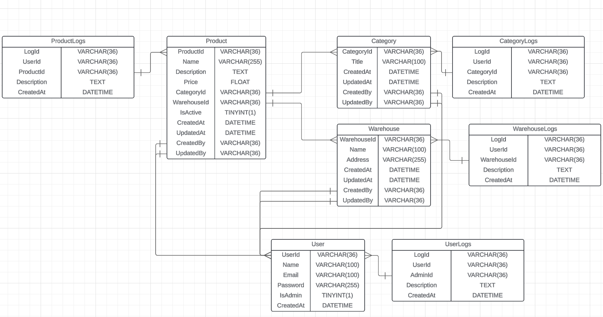

# SISTEMA CRUD de productos, categorías, almacenes y usuarios

Este proyecto es un sistema CRUD desarrollado con PHP, MySQL y Composer. La aplicación gestiona productos, categorías, almacenes y usuarios, y cuenta con un sistema de logs que registra los cambios realizados en los modelos por los usuarios.

## Funciones principales
* Usuarios administradores
  * Realizar operaciones CRUD (Crear, Leer, Actualizar y Eliminar) sobre los modelos de productos, categorías, almacenes y usuarios.
  * Asignar permisos de administrador a otros usuarios.
  * Ver el historial de cambios (logs) de los productos, categorías, almacenes y usuarios, incluyendo quién realizó los cambios, qué cambios se hicieron y cuándo.
* Usuarios normales
  * Ver la lista de productos.
  * No tienen permisos para modificar productos, categorías, almacenes o usuarios.

## Diagrama entidad-relación

### Productos
* Cada producto pertenece a una única categoría y un único almacén.
* Los productos pueden cambiar de categoría y almacén en cualquier momento.
* Los administradores pueden realizar todas las operaciones CRUD sobre los productos.
### Categorías
* Una categoría puede contener varios productos.
* Los administradores pueden gestionar las categorías, realizando operaciones CRUD.
### Almacenes
* Un almacén puede contener varios productos.
* Los administradores pueden gestionar los almacenes, realizando operaciones CRUD.
### Sistema de logs
* Se registra cada operación CRUD realizada por cualquier usuario.
* ¿Qué incluyen los logs?
  * Usuario que realizó la acción sobre un producto, categoría o almacén
  * Fecha de cuando se hicieron los cambios
  * Solo los administradores tienen acceso al sistema de logs
## Requisitos
* PHP 8.0+
* MySQL 5.7+
* Composer para la gestión de dependencias
## Instalación
1. `git clone git@github.com:Dac099/YNE-CRUD.git`
2. `cd YNE-CRUD`
3. `composer install`
4. Configurar las variables de entorno acorde a tu base de datos.

## Notas
El proyecto se desarrolló con el servidor Apache. El desarrollo del proyecto se llevó a cabo en el directorio /var/www/html.
En caso de utilizar otro sistema u otro servidor hay que hacer las configuraciones necesarias para ejecutar el proyecto